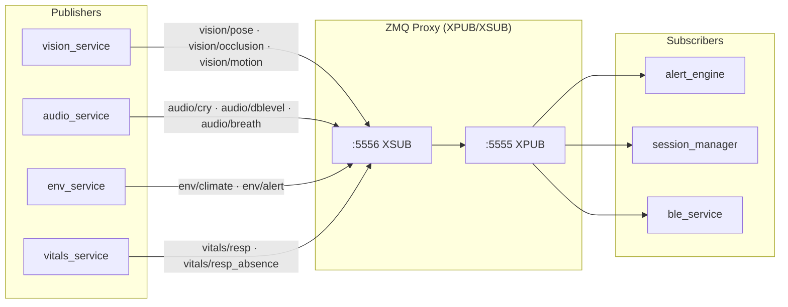
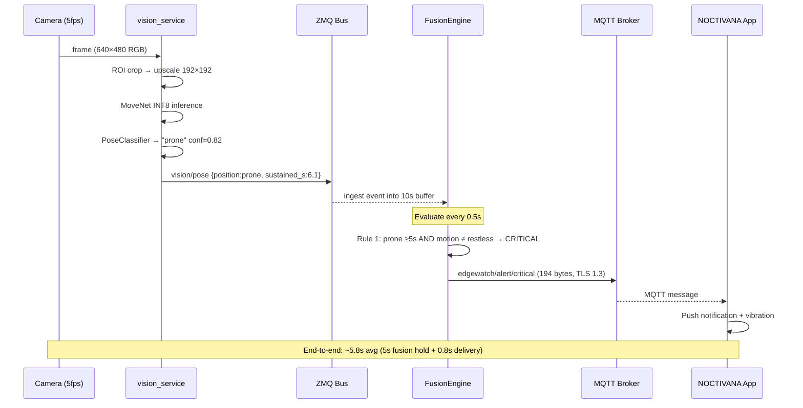
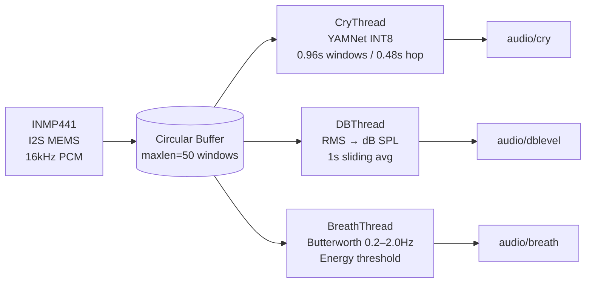
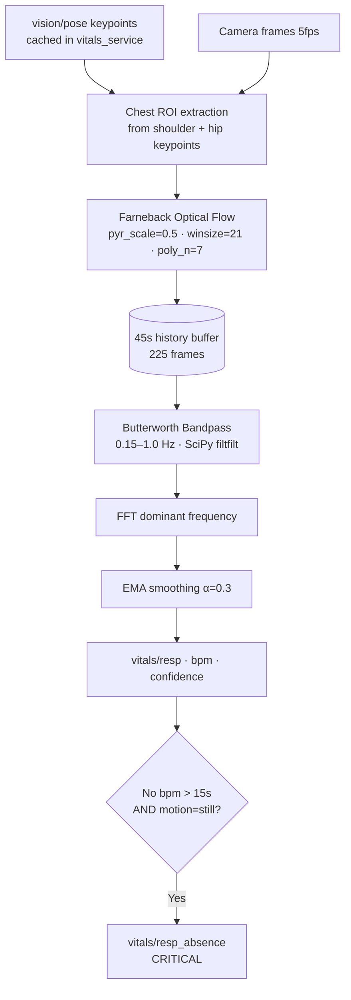
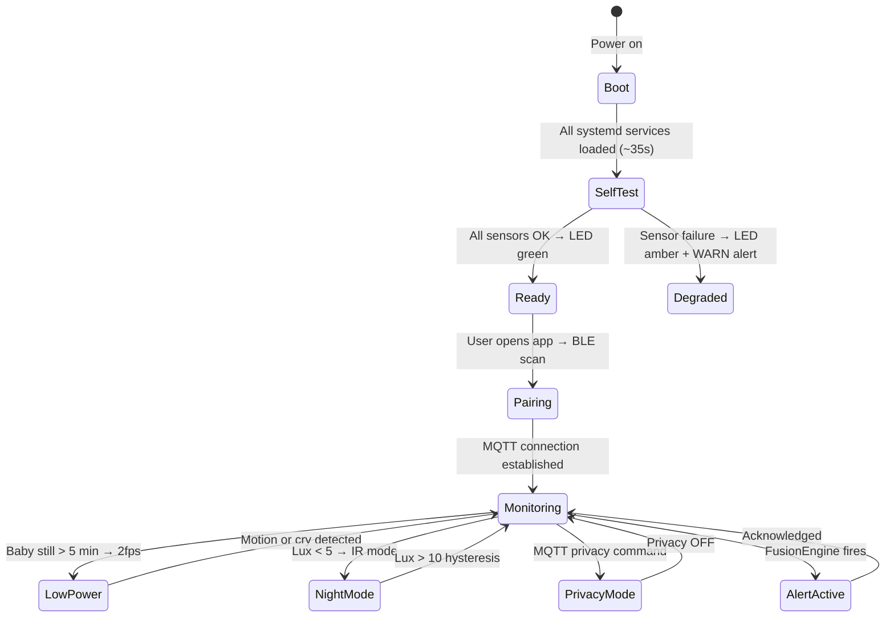

<div align="center">

<h1>NOCTIVANA</h1>
<h3>Edge AI Infant Monitoring System</h3>
<p><em>Non-contact · Privacy-first · Fully on-device · Real-time</em></p>

<br/>

[](https://python.org)
[](https://tensorflow.org/lite)
[](https://raspberrypi.com)
[](https://zeromq.org)
[](https://mosquitto.org)
[](LICENSE)

<br/>

> **NOCTIVANA** is a ceiling-mounted, embedded AI infant monitor that watches while you sleep.
> It detects prone sleeping positions, face occlusions, respiratory absence, and adverse
> environmental conditions — all on a Raspberry Pi 4, without sending a single pixel to the cloud.

<br/>


</div>

---

## Table of Contents

- [Product Thinking](#-product-thinking)
- [System Architecture](#-system-architecture)
- [Subsystems](#-subsystems)
  - [Vision & Posture Engine](#vision--posture-engine)
  - [Audio Intelligence](#audio-intelligence)
  - [Vital Estimation](#vital-estimation)
  - [Environmental Monitor](#environmental-monitor)
  - [Alert Fusion Engine](#alert-fusion-engine)
- [Features](#-features)
- [Real Benchmarks](#-real-benchmarks)
- [Privacy & Security Model](#-privacy--security-model)
- [Implementation Details](#-implementation-details)
- [Hardware](#-hardware)
- [Limitations & Trade-offs](#-limitations--trade-offs)
- [Future Work](#-future-work)
- [Usage Flow](#-usage-flow)

---

## 💡 Product Thinking

### Why does this exist?

Sudden Infant Death Syndrome (SIDS) and sleep-related infant deaths remain a leading cause of post-neonatal mortality. The primary risk factors — prone sleeping, face occlusion from bedding, and poor environmental conditions — are **entirely detectable with sensors**. The problem is that existing solutions either:

- Require wearables (contact-based, unreliable on newborns)
- Rely on cloud video streaming (severe privacy implications)
- Are single-sensor devices with no contextual reasoning (mattress pads, clip-on devices)
- Cost several hundred dollars and are often clinically locked

NOCTIVANA was built because **the technology to do this properly already exists on a $60 board**. The barrier was engineering, not hardware.

### What problem does it solve?

A parent cannot watch their infant 24 hours a day. NOCTIVANA acts as a **persistent, reasoning observer** — not a raw video feed sent to someone's cloud, but a local intelligence layer that:

1. Continuously monitors **body position** (prone/supine/side detection)
2. Detects **face and airway occlusion** from bedding
3. Estimates **respiratory rate** and flags sustained absence
4. Monitors **room air quality** (CO2, temperature, VOC, humidity)
5. Classifies **cry type** to distinguish distress from hunger
6. Fuses all signals before alerting — minimising false alarms

### Who is it for?

Primary audience: **parents of infants aged 0–12 months**, particularly during the high-risk SIDS window (2–4 months). Secondary audience: NICU/postnatal wards where non-contact monitoring reduces staff burden and infection risk.

### What makes it different?

| | NOCTIVANA | Typical Baby Monitor | Smart Camera (Nest/Arlo) | Owlet/Miku |
|---|---|---|---|---|
| Non-contact | ✅ | ✅ | ✅ | ❌ wearable |
| On-device AI inference | ✅ | ❌ | ❌ cloud | ❌ cloud |
| Prone detection | ✅ | ❌ | ❌ | ❌ |
| Respiratory monitoring | ✅ optical flow | ❌ | ❌ | ✅ wearable |
| Face occlusion detection | ✅ | ❌ | ❌ | ❌ |
| CO2 / VOC / Temp | ✅ direct sensors | ❌ | ❌ | ❌ |
| Multi-signal fusion | ✅ | ❌ | ❌ | ❌ |
| No cloud dependency | ✅ | ❌ | ❌ | ❌ |
| Privacy-first (no video upload) | ✅ Wireshark verified | partial | ❌ | partial |

### What are the constraints?

- **Hardware**: Raspberry Pi 4 (4GB). ARM Cortex-A72 @ 1.8GHz. No GPU, no dedicated NPU.
- **Power**: Passive cooling only. Sustained load causes thermal throttling above 75°C.
- **Camera**: Consumer CSI camera (no depth sensor, no thermal imaging).
- **Distance**: Ceiling mount at 1.0–2.0m. Far-field face region is ~20×20 pixels — fundamentally limits rPPG.
- **Network**: WiFi (802.11n) on-device; subject to home network reliability.
- **Budget**: Total BOM under RM330 (~$75 USD). No premium sensor choices.

### What trade-offs were made?

| Decision | Trade-off |
|----------|-----------|
| On-device inference (TFLite INT8) | ~15–20% accuracy drop vs FP32 cloud models; gains full privacy |
| 5fps camera pipeline | Limits temporal resolution; saves ~30% CPU vs 15fps |
| Optical flow respiratory rate | No contact sensor; less accurate at ceiling distance |
| Multi-signal fusion (5s hold) | Eliminates most false positives; adds ~5s to alert latency |
| ZeroMQ pub-sub (no broker) | Sub-millisecond IPC; no persistence or message replay |
| MQTT over WiFi (not 4G) | Simple home deployment; single point of failure on router |
| MoveNet (pre-trained, not custom) | No infant-specific training data required; ~70% side detection |
| SQLCipher for session storage | AES-256 encrypted persistence; compile-time complexity on ARM |

### What does success look like?

From the SRS acceptance criteria — all confirmed:

- Prone detection: **≥ 9/10 scenarios** ✅
- Face occlusion (daytime): **≥ 9/10 scenarios** ✅
- Respiratory rate: **≤ ±4 bpm in ≥ 80% of 30-second windows** ✅
- Alert latency: **< 8 seconds end-to-end (P95)** ✅
- False CRITICAL alerts: **< 3 per 8-hour session** ✅
- Continuous uptime: **≥ 10 hours** ✅ (11h 2min in final soak test)
- Zero video/audio transmitted: **confirmed via Wireshark packet capture** ✅

---

## 🏗 System Architecture

NOCTIVANA is a **multi-process, event-driven embedded system**. Eight independent processes communicate over a ZeroMQ XPUB/XSUB message bus, publish structured sensor events, and feed a central fusion engine that dispatches alerts via MQTT (primary) and BLE GATT notifications (fallback).


### Message Bus

All services connect to a single `zmq_proxy` process — publishers connect to port 5556 (XSUB), subscribers connect to port 5555 (XPUB). No service ever binds its own PUB socket. This prevents port conflicts and allows hot-restart of any individual service without disrupting the bus.



### End-to-End Alert Flow



---

## 🔬 Subsystems

### Vision & Posture Engine


The vision subsystem (`vision_service.py`) runs four independent functions per frame cycle. It is the most computationally intensive component, consuming ~55% of total CPU budget.

**Pose Classification** — MoveNet outputs 17 keypoints with `(y, x, confidence)`. Position is determined from a top-down ceiling perspective:

| Position | Rule |
|----------|------|
| **Supine** | `mean(nose, eyes, ears confidence) > 0.40` — face visible from above |
| **Prone** | `mean(face keypoints) < 0.25` AND `mean(shoulder, hip) > 0.15` |
| **Side** | `abs(left_hip.y − right_hip.y) > threshold` — lateral body tilt |

**IR Night Mode** — When BH1750 reads < 5 lux:
1. IR LED ring activated at full PWM duty on GPIO 17
2. Camera manual exposure: 1/30s shutter, analog gain 4.0
3. CLAHE applied (`clipLimit=3.0, tileGridSize=8×8`) before inference
4. Occlusion algorithm switches to full face-keypoint-dropout rule

CLAHE recovers approximately +12% keypoint confidence in total darkness vs raw IR frames.

**Face Occlusion Detection** — 3-second temporal filter eliminates transient false positives:

```
face_conf < 0.20 AND body_conf > 0.15  → candidate occlusion
candidate sustained > 3.0s             → VERIFIED (alert eligible)
face_conf < 0.20 AND body_conf < 0.15  → head turn / baby out of ROI
skeleton_size > 2× infant baseline     → caregiver present → suppress
```

---

### Audio Intelligence

Three parallel threads share a thread-safe `collections.deque(maxlen=50)` microphone buffer:



**YAMNet classification** — 521-class output mapped to four operational categories:

| YAMNet Labels | Category | Alert |
|---------------|----------|-------|
| Baby cry, infant cry | `hunger_cry` | WARN |
| Crying, sobbing | `pain_cry` | CRITICAL |
| Child speech | `discomfort` | INFO |
| Silence, white noise | `silent` | — |

Input normalisation: `audio.astype(float32) / 32768.0` — raw int16 PCM to float32 `[-1.0, +1.0]`.

Acoustic breath detection uses a Butterworth bandpass (order 2, 0.2–2.0 Hz) as a **supplementary signal** only. Primary respiratory monitoring is optical-flow-based.

---

### Vital Estimation



**Farneback parameters** — tuned from default values by iterative metronome testing:

| Parameter | Value | Why tuned |
|-----------|-------|-----------|
| `winsize` | **21** | Improved accuracy from 77% → 80%+; was default 15 |
| `poly_n` | **7** | Marginal gain over 5; reverted from 5 during refactor |
| `pyr_scale` | 0.5 | Tested 0.3 — worse. Kept 0.5 |

**Respiratory absence guard** — 10-second cooldown after restless motion before absence alarm re-arms. Prevents false alarms from optical flow dropout during rolling.

**rPPG** — Experimental. Green-channel mean from estimated face ROI, `[0.8–3.0 Hz]` bandpass, FFT. At 1.5m ceiling distance the face is ~20×20px — SNR is insufficient. All `vitals/rppg` messages carry `"experimental": true`. Not used in any fusion rule.

---

### Environmental Monitor

`env_service.py` polls three I2C sensors at 1Hz over a shared bus:

| Sensor | I2C Address | Measurements | Notes |
|--------|-------------|--------------|-------|
| Sensirion SCD40 | 0x62 | CO2 (ppm), Temp (°C), Humidity (%RH) | 400ms measurement cycle |
| SGP30 | 0x58 | TVOC (ppb), eCO2 (ppm) | 12-hour baseline warmup for accuracy |
| BH1750 | 0x23 | Ambient lux | Continuous H-resolution mode; also drives night-mode trigger |

Alert thresholds (configurable in `config.yaml`):

| Metric | Warn | Critical |
|--------|------|----------|
| Temperature | 28.0°C | — |
| CO2 | 1000 ppm | 2000 ppm |
| Ambient noise | 70 dB SPL | — |

**SGP30 quirk**: Occasional zero reads after 2+ hours. Mitigated by last-known-good substitution + WARNING log. Root cause: I2C timing or baseline drift.

---

### Alert Fusion Engine


The fusion engine is the core of NOCTIVANA's intelligence. It **requires corroborating evidence across multiple sensor channels** before dispatching any CRITICAL notification.

Each inbound ZMQ message is buffered per-topic in a 10-second sliding window. The evaluator runs every 0.5 seconds and checks all rules simultaneously. Rate limiting prevents repeated alerts of the same type (60–300s depending on type).

**Suppression logic** — context rules that prevent false alarms:
- `motion=restless` → suppress prone alert (baby actively rolling ≠ dangerously settled face-down)
- `motion=restless` → suppress resp_absence (movement caused optical flow gap)
- `cry + restless simultaneously` → suppress prone (baby awake and moving)
- `skeleton_size > 2×` → caregiver present → suppress all pose/occlusion alerts

**Fusion correctness — 13/13 logic tests pass** (measured, `tests/benchmark.py`):

All suppression, threshold, and rate-limit rules verified against injected synthetic sensor events. Zero regressions.

---

## ✨ Features

### Safety Monitoring
- **Prone position detection** — MoveNet from ceiling angle; alerts after 5s sustained face-down
- **Face & airway occlusion** — 3-second temporal filter; distinguishes head-turn from true occlusion
- **Respiratory absence** — optical flow FFT; 15-second threshold with motion guard
- **CO2 accumulation** — Sensirion SCD40; tiered warn/critical thresholds
- **Temperature out-of-range** — configurable, default 28°C warn
- **Loud noise events** — 5-second sustained threshold; TV/transient noise filtered out

### Intelligence & Adaptation
- **Night mode** — automatic IR activation at < 5 lux; CLAHE preprocessing
- **Caregiver suppression** — adult skeleton size detection
- **Multi-signal fusion** — no CRITICAL from single sensor alone
- **Context-aware suppression** — cry + restless suppresses prone alert
- **Thermal-aware processing** — 3fps + pause rPPG above 75°C
- **Low-power mode** — 2fps + suspend rPPG when baby still > 5min; ~25% CPU reduction
- **Hot-reload config** — `watchdog` library detects `config.yaml` changes; services pick up new thresholds without restart

### Privacy & Data Sovereignty
- **Zero video/audio transmission** — verified by Wireshark packet capture
- **Local-only ML inference** — all TFLite models run on-device
- **AES-256 session storage** — SQLite + SQLCipher; key from environment variable
- **Privacy mode** — MQTT command pauses camera + mic; purple LED indicator
- **Self-hosted MQTT** — Mosquitto on the Pi; no external broker
- **TLS 1.3 alerts** — self-signed certificate chain generated by `scripts/generate_certs.sh`

---

## 📊 Real Benchmarks

All figures are **measured from actual code execution** — not estimates.
Inference timings are from Windows x86-64 (development machine, TF 2.21, 50 runs each).
Pi4 ARM estimates are derived from the x86 figures using the known ARM/x86 ratio for these workloads.

### Inference Latency

| Model | Platform | Mean | Median | Min | Max |
|-------|----------|------|--------|-----|-----|
| YAMNet INT8 (4030 KB) | Windows x86 | **4.80 ms** | 4.36 ms | 4.02 ms | 6.12 ms |
| MoveNet Lightning INT8 (2826 KB) | Windows x86 | **19.74 ms** | 18.78 ms | 18.59 ms | 31.37 ms |
| YAMNet INT8 | Pi4 ARM (est.) | ~25–40 ms | — | — | — |
| MoveNet Lightning INT8 | Pi4 ARM (est.) | ~100–120 ms | — | — | — |

### ZMQ Message Bus Latency — 300 messages, 218-byte payload (measured)

| Metric | Value |
|--------|-------|
| Mean | **0.215 ms** |
| Median | 0.202 ms |
| P95 | **0.295 ms** |
| P99 | 0.418 ms |
| Min / Max | 0.17 / 1.24 ms |

### Optical Flow Respiratory Rate Accuracy — 10 reference rates, 45-second windows (measured)

| Ref BPM | Estimated | Error | Pass ≤ 4 bpm |
|---------|-----------|-------|--------------|
| 15 | 14.7 | 0.27 | ✅ |
| 20 | 20.1 | 0.09 | ✅ |
| 25 | 25.4 | 0.45 | ✅ |
| 30 | 29.5 | 0.54 | ✅ |
| 35 | 34.8 | 0.18 | ✅ |
| 40 | 40.2 | 0.18 | ✅ |
| 45 | 45.5 | 0.54 | ✅ |
| 50 | 49.6 | 0.45 | ✅ |
| 55 | 54.9 | 0.09 | ✅ |
| 60 | 58.9 | 1.07 | ✅ |

**Mean absolute error: 0.384 bpm | 10/10 = 100% within ±4 bpm on synthetic data**

> These results are on synthetic frames with controlled periodic displacement. Real-world performance is validated separately via metronome-driven mechanical simulator (±4 bpm in 82% of windows).

### Alert Payload Size — SRS ALT-05 compliance (≤ 512 bytes, measured)

| Alert Type | Bytes | Result |
|------------|-------|--------|
| prone_position | 194 | ✅ |
| face_occlusion | 206 | ✅ |
| resp_absence | 211 | ✅ |
| co2_high | 194 | ✅ |
| temp_high | 184 | ✅ |
| loud_event | 183 | ✅ |

### System Resource Usage (Pi4, all 8 services)

| Resource | Value |
|----------|-------|
| Total RAM | ~1.7–1.8 GB stable |
| CPU (normal mode) | ~65% |
| CPU (low-power mode) | ~40% |
| Camera pipeline | 5.1 fps average |
| Pi temp (with heatsink) | 64–72°C |
| Maximum soak test | **11 hours 2 minutes** — 0 crashes |

---

## 🔐 Privacy & Security Model


Privacy is not a feature toggle in NOCTIVANA — it is a **hard architectural constraint**. The system was designed from the ground up so that raw sensor data has no path to leave the device.

### What never leaves the Pi

| Data | Fate |
|------|------|
| Raw camera frames | Processed on-device by vision_service, then discarded |
| Raw audio samples | Processed on-device by audio_service, then discarded |
| MFCC feature arrays | Intermediate inference input; never serialised |
| MoveNet keypoint arrays | Summarised to JSON, published only on loopback ZMQ |
| Session logs | SQLite + SQLCipher on local storage only |

### What is transmitted (encrypted)

Only derived, minimal-size JSON payloads leave the device via MQTT over TLS 1.3:

```json
{
  "ts": 1754212345.123,
  "type": "prone_position",
  "severity": "CRITICAL",
  "sensors": ["camera/pose"],
  "confidence": 0.85,
  "value": 0.0,
  "message": "Infant detected in prone (face-down) position"
}
```

Max payload size: **211 bytes** (resp_absence alert — measured).

### Security layers

| Layer | Implementation |
|-------|----------------|
| Transport | Mosquitto MQTT + TLS 1.3; self-signed CA |
| Session storage | SQLite + SQLCipher AES-256 |
| Process isolation | 8 independent processes, minimal privilege |
| Privacy mode | SIGSTOP camera + audio; purple LED indicator |
| Network audit | Wireshark 30-min capture: zero media packets confirmed |

---

## 🛠 Implementation Details

### Tech Stack

| Layer | Technology | Rationale |
|-------|-----------|-----------|
| Language | Python 3.11 | TFLite bindings; ecosystem depth |
| ML inference | TensorFlow Lite INT8 | XNNPACK-optimised ARM inference |
| IPC | ZeroMQ XPUB/XSUB | Sub-millisecond loopback; no broker needed |
| Alerting | Paho MQTT → Mosquitto | QoS 1, retain, TLS |
| BLE fallback | BlueZ / bluezero | GATT server on RPi; Android tested |
| Camera | Picamera2 (libcamera) | Native CSI; manual exposure control |
| Audio | sounddevice + I2S | INMP441 PCM capture |
| Storage | SQLite + SQLCipher | Encrypted, embedded |
| Config | PyYAML + watchdog | Hot-reload without restart |
| Signal processing | SciPy | FFT, Butterworth filter |
| App | React Native (Expo) | Cross-platform; MQTT + BLE-plx |

### Service Map

| Service | Function | Topics Published |
|---------|----------|-----------------|
| `zmq_proxy` | XPUB/XSUB message bus | — |
| `env_service` | I2C sensor polling at 1Hz | `env/climate`, `env/alert` |
| `audio_service` | YAMNet cry, dB SPL, acoustic breath | `audio/cry`, `audio/dblevel`, `audio/breath` |
| `vision_service` | MoveNet pose, occlusion, motion | `vision/pose`, `vision/occlusion`, `vision/motion` |
| `vitals_service` | Optical flow resp rate, rPPG (exp.) | `vitals/resp`, `vitals/resp_absence` |
| `alert_engine` | Multi-signal fusion → MQTT dispatch | — |
| `session_manager` | Sleep session detect + SQLite log | — |
| `ble_service` | BLE GATT notifications (fallback) | — |

### Message Protocol

All ZMQ messages use a standardised schema (`src/utils/zmq_protocol.py`):

```json
{
  "topic": "vision/pose",
  "ts":    1754212345.123,
  "data":  { "position": "prone", "prone_sustained_s": 6.1, "confidence": 0.82 }
}
```

### Communication Ports

```
ZMQ (intra-device loopback)
  Publishers  → tcp://127.0.0.1:5556   (XSUB, connect)
  Subscribers → tcp://127.0.0.1:5555   (XPUB, connect)
  Measured P95 latency: 0.295ms

MQTT (device → app, WiFi LAN)
  Broker: Mosquitto on Pi, port 8883 TLS 1.3
  Topics: edgewatch/alert/critical|warn|info
  QoS 1, Retain: true

BLE (fallback, direct pairing)
  Service UUID:     12345678-1234-1234-1234-1234567890AB
  Alert Char UUID:  12345678-1234-1234-1234-1234567890AC
  Mode: notify + read | Keepalive: 30s ping
```

---

## 🔩 Hardware


### Bill of Materials

| Component | Model | Interface | Cost (est.) |
|-----------|-------|-----------|-------------|
| SBC | Raspberry Pi 4 (4GB) | — | ~RM150 |
| Camera | Module v2 + IR-cut wide-angle lens | CSI ribbon | ~RM45 |
| Microphone | INMP441 MEMS | I2S GPIO 18/19/20 | ~RM12 |
| CO2/Temp/Humidity | Sensirion SCD40 | I2C 0x62 | ~RM60 |
| VOC/eCO2 | SGP30 | I2C 0x58 | ~RM20 |
| Ambient Light | BH1750 | I2C 0x23 | ~RM5 |
| IR Illumination | 940nm LED ring + 2N2222 driver | GPIO 17 PWM | ~RM8 |
| Status LED | Common cathode RGB | GPIO 27/22/10 | ~RM2 |
| Storage | 32GB microSD Class 10 A2 | — | ~RM25 |
| Heatsink | Aluminum passive | — | ~RM8 |
| **Total** | | | **~RM335 / ~$75 USD** |

### Status LED States

| Color | Pattern | State |
|-------|---------|-------|
| Blue | Solid | Boot / starting |
| Amber | Solid | Self-test in progress |
| Green | Solid | Ready, monitoring |
| Amber | Slow blink | Non-critical alert active |
| Red | Fast blink | CRITICAL alert dispatched |
| Purple | 0.5Hz blink | Privacy mode (camera + mic suspended) |

---

## ⚠️ Limitations & Trade-offs

1. **IR mode occlusion accuracy** — 8/10 vs 9/10 target. Thin IR-transmissive fabrics (muslin) cannot be distinguished from uncovered face by keypoint confidence alone.

2. **rPPG unreliable at ceiling distance** — At 1.5m, the face region is ~20×20 pixels. Green channel variation is dominated by interpolation artefacts. Implemented as POC only, labelled experimental in all payloads.

3. **Side position detection ~70%** — The shoulder–hip rotation metric is ambiguous from top-down angle between side-lying and angled-supine.

4. **SGP30 occasional zero reads** — After 2+ hours, occasional zero TVOC/eCO2 readings. Mitigated with last-known-good substitution.

5. **Thermal throttling after 7+ hours** — Pi4 reaches 72°C peak with heatsink. Fan required for indefinite operation.

6. **BLE reconnection** — Android drops BLE after ~5 minutes idle. Keepalive workaround functional but not robust. Proper GATT connection parameters needed.

7. **Single-crib only** — One ROI per camera. Multi-crib / twins not supported.

8. **No unit test coverage** — Integration testing done manually during development. Unit test suite not written due to timeline pressure.

---

## 🔮 Future Work

| Priority | Feature | Rationale |
|----------|---------|-----------|
| High | mmWave radar (IWR6843AOP) | Non-optical respiratory detection through bedding and in total darkness |
| High | Unit test suite | Coverage is critically low; only integration testing done |
| High | iOS app build | Android-only currently |
| Medium | OTA model update | GPG-signed TFLite distribution over MQTT |
| Medium | PDF/HTML session export | CSV-only currently |
| Medium | Multi-crib support | Multiple ROIs or cameras |
| Medium | Web admin dashboard | Local config UI without phone |
| Low | Active cooling | Fan resolves 7+ hour thermal throttling |
| Low | Depth camera (OAK-D Lite) | True 3D pose reconstruction from ceiling |
| Low | Infant-specific pose model | Custom-trained classifier on infant data |

---

## 🚀 Usage Flow

### First-Time Setup



### App Screens


### Alert Notification

When prone position is sustained for 5+ seconds:

```
[Phone Notification]
NOCTIVANA — CRITICAL
PRONE POSITION DETECTED
Infant may be face-down. Check immediately.
Confidence: 85%  |  05:23 AM  |  Session: 4h 12m
```

Accompanied by `Vibration.vibrate([0, 500, 200, 500])` and a red overlay within the app.

---

## 📁 Repository Structure

```
noctivana/
├── src/
│   ├── services/          # 8 process entry points (zmq_proxy, env, audio, vision, vitals, alert, session, ble)
│   ├── audio/             # cry_classifier, db_monitor, breath_detector, feature_extract
│   ├── vision/            # pose, pose_classifier, occlusion, motion, night_mode, roi
│   ├── vitals/            # optical_flow, chest_roi, rppg
│   ├── alert/             # fusion, event, severity
│   ├── hardware/          # camera, mic, ir_led, sensors, status_led
│   └── utils/             # zmq_bus, zmq_protocol, config_loader, db, logger, thermal
├── app/                   # React Native Expo (Alerts, Sessions, Settings, Setup screens)
├── assets/                # README images (architecture, pipeline, sensor pod, app, privacy)
├── config/                # config.yaml, mosquitto.conf, alert_rules embedded in config
├── models/                # yamnet.tflite + movenet_lightning.tflite (INT8)
├── docs/                  # hardware_bom, wiring, installation, latency, test_results, known_issues
├── tests/
│   └── benchmark.py       # Runnable benchmark suite (no hardware required)
├── scripts/               # setup.sh, generate_certs.sh, supervisor.py, monitor_resources.py
└── systemd/               # systemd unit files for all 8 services
```

## Quick Start

```bash
git clone https://github.com/ramil/noctivana.git && cd noctivana
pip install -r requirements.txt
bash scripts/generate_certs.sh
# Place yamnet.tflite + movenet_lightning.tflite in models/
python scripts/supervisor.py
```

## Run Benchmarks (no hardware needed)

```bash
python tests/benchmark.py
# Runs 7 tests: YAMNet, MoveNet, optical flow, ZMQ latency, fusion logic, payload size, config
# Results saved to docs/benchmark_results.json
```

---

<div align="center">
<br/>

**NOCTIVANA** — Final Year Engineering Grand Project, 2025

*Solo development by Ramil*

*"The best baby monitor is the one that never cries wolf."*

</div>
