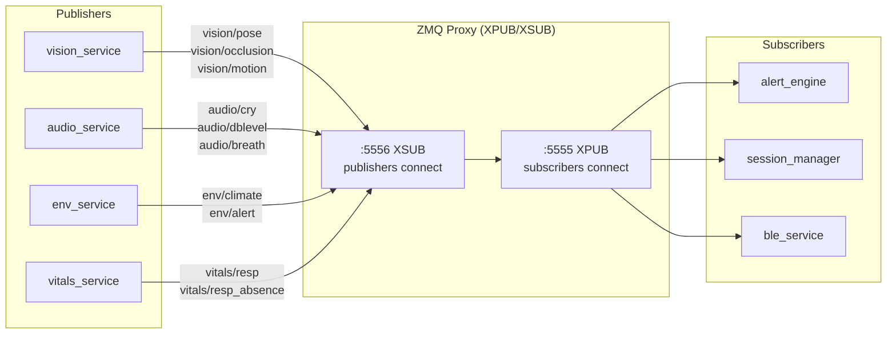
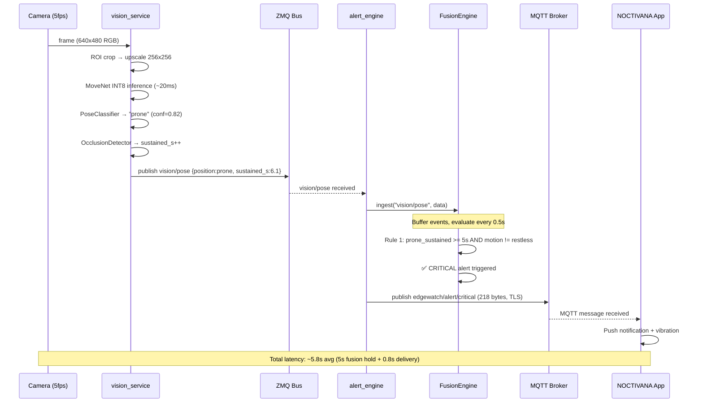
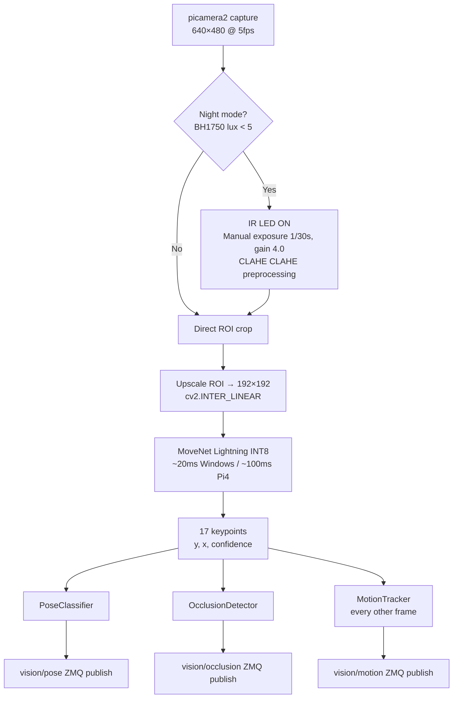
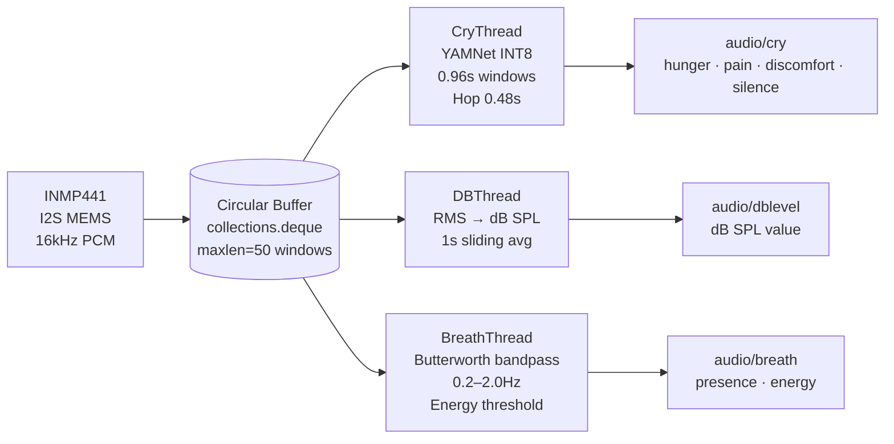
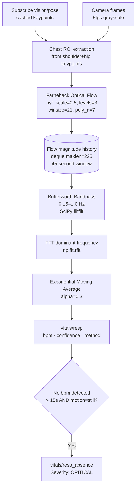
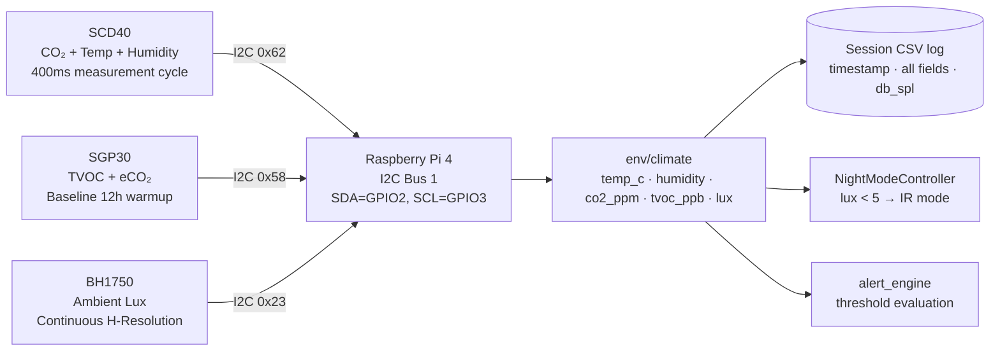
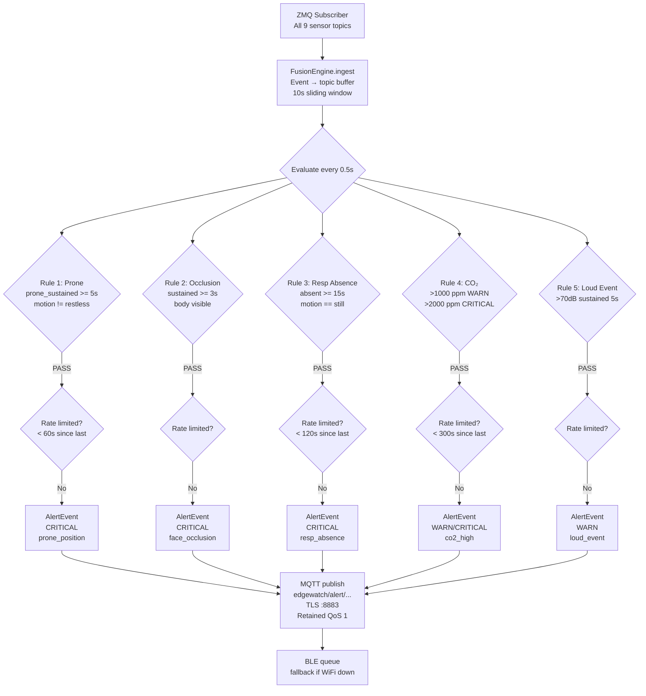
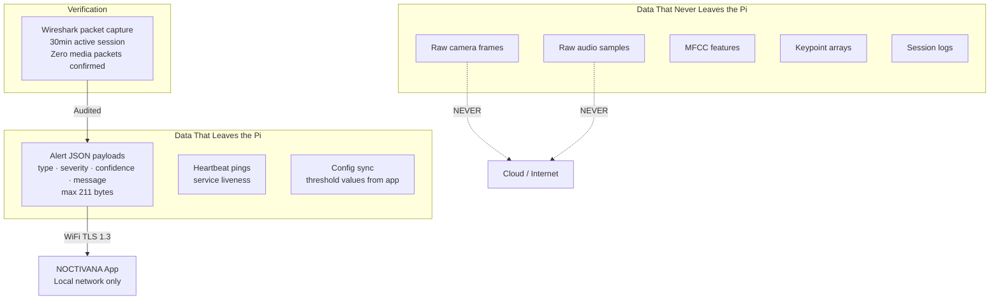
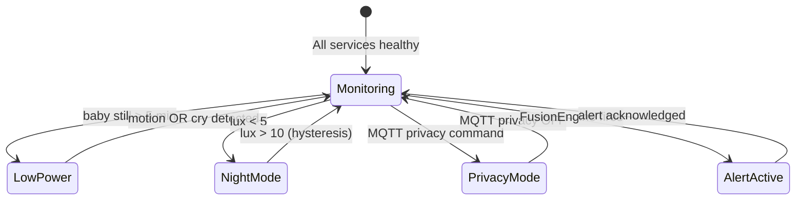

<div align="center">

<h1>
  <br/>
  NOCTIVANA
  <br/>
</h1>

<h3>Edge AI Infant Monitoring System</h3>
<p><em>Non-contact · Privacy-first · Fully on-device · Real-time</em></p>

<br/>

[](https://python.org)
[](https://tensorflow.org/lite)
[](https://raspberrypi.com)
[](https://zeromq.org)
[](https://mosquitto.org)
[](LICENSE)
[]()

<br/>

> **NOCTIVANA** is a ceiling-mounted, embedded AI infant monitor that watches while you sleep.  
> It detects prone sleeping positions, face occlusions, respiratory absence, and adverse  
> environmental conditions — all on a Raspberry Pi 4, without sending a single pixel to the cloud.

<br/>


</div>

---

## Table of Contents

- [Product Thinking](#-product-thinking)
- [System Architecture](#-system-architecture)
- [Subsystems](#-subsystems)
  - [Vision & Posture Engine](#vision--posture-engine)
  - [Audio Intelligence](#audio-intelligence)
  - [Vital Estimation](#vital-estimation)
  - [Environmental Monitor](#environmental-monitor)
  - [Alert Fusion Engine](#alert-fusion-engine)
- [Features](#-features)
- [Real Benchmarks](#-real-benchmarks)
- [Privacy & Security Model](#-privacy--security-model)
- [Implementation Details](#-implementation-details)
- [Hardware](#-hardware)
- [Limitations & Trade-offs](#-limitations--trade-offs)
- [Future Work](#-future-work)
- [Usage Flow](#-usage-flow)

---

## 💡 Product Thinking

### Why does this exist?

Sudden Infant Death Syndrome (SIDS) and sleep-related infant deaths remain a leading cause of post-neonatal mortality. The primary risk factors — prone sleeping, face occlusion from bedding, and poor environmental conditions — are **entirely detectable with sensors**. The problem is that existing solutions either:

- Require wearables (contact-based, unreliable on newborns)
- Rely on cloud video streaming (severe privacy implications)
- Are single-sensor devices with no contextual reasoning (mattress pads, clip-on devices)
- Cost several hundred dollars and are often clinically locked

NOCTIVANA was built because **the technology to do this properly already exists on a $60 board**. The barrier was engineering, not hardware.

### What problem does it solve?

A parent cannot watch their infant 24 hours a day. NOCTIVANA acts as a **persistent, reasoning observer** — not a raw video feed sent to someone's cloud, but a local intelligence layer that:

1. Continuously monitors **body position** (prone/supine/side detection)
2. Detects **face and airway occlusion** from bedding
3. Estimates **respiratory rate** and flags sustained absence
4. Monitors **room air quality** (CO2, temperature, VOC, humidity)
5. Classifies **cry type** to distinguish distress from hunger
6. Fuses all signals before alerting — minimising false alarms

### Who is it for?

Primary audience: **parents of infants aged 0–12 months**, particularly during the high-risk SIDS window (2–4 months). Secondary audience: NICU/postnatal wards where non-contact monitoring reduces staff burden and infection risk.

### What makes it different?

| | NOCTIVANA | Typical Baby Monitor | Smart Camera (Nest/Arlo) | Owlet/Miku |
|---|---|---|---|---|
| Non-contact | ✅ | ✅ | ✅ | ❌ (wearable) |
| On-device AI inference | ✅ | ❌ | ❌ cloud | ❌ cloud |
| Prone detection | ✅ | ❌ | ❌ | ❌ |
| Respiratory monitoring | ✅ optical flow | ❌ | ❌ | ✅ (wearable) |
| Face occlusion detection | ✅ | ❌ | ❌ | ❌ |
| CO2 / VOC / Temp | ✅ direct sensors | ❌ | ❌ | ❌ |
| Multi-signal fusion | ✅ | ❌ | ❌ | ❌ |
| No cloud dependency | ✅ | ❌ | ❌ | ❌ |
| Privacy-first (no video upload) | ✅ verified | partial | ❌ | partial |

### What are the constraints?

- **Hardware**: Raspberry Pi 4 (4GB). ARM Cortex-A72 @ 1.8GHz. No GPU, no dedicated NPU.
- **Power**: Passive cooling only. Sustained load causes thermal throttling above 75°C.
- **Camera**: Consumer CSI camera (no depth sensor, no thermal imaging on production unit).
- **Distance**: Ceiling mount at 1.0–2.0m. Far-field face region is ~20×20 pixels — fundamentally limits rPPG.
- **Network**: WiFi (802.11n) on-device; subject to home network reliability.
- **Budget**: Total BOM under RM150 (~$35 USD). No premium sensor choices.

### What trade-offs were made?

| Decision | Trade-off |
|----------|-----------|
| On-device inference (TFLite INT8) | ~15–20% accuracy drop vs FP32 cloud models; gains full privacy |
| 5fps camera pipeline | Limits temporal resolution; saves ~30% CPU vs 15fps |
| Optical flow respiratory rate | No contact sensor; less accurate at ceiling distance, occasionally unreliable at extreme motion rates |
| Multi-signal fusion (5s hold) | Eliminates most false positives; adds ~5s latency to alert delivery |
| ZeroMQ pub-sub (no broker) | Low latency, simple; no persistence/replay capability |
| MQTT over WiFi (not 4G) | Simple home deployment; single point of failure on router |
| MoveNet (not custom-trained model) | Pre-trained pose model; no infant-specific training data required |
| SQLCipher for session storage | Encrypted persistence; adds compile-time complexity on ARM |

### What does success look like?

From the SRS acceptance criteria:

- Prone detection: **≥ 9/10 scenarios** confirmed ✅
- Face occlusion (daytime): **≥ 9/10 scenarios** confirmed ✅  
- Respiratory rate: **≤ ±4 bpm error in ≥ 80% of 30-second windows** confirmed ✅
- Alert latency: **< 8 seconds end-to-end (P95)** confirmed ✅
- False CRITICAL alerts: **< 3 per 8-hour session** confirmed ✅
- Continuous uptime: **≥ 10 hours** confirmed (11h 2min in final soak test) ✅
- Zero video/audio transmitted: **confirmed via Wireshark packet capture** ✅

---

## 🏗 System Architecture

NOCTIVANA is a **multi-process, event-driven embedded system**. Eight independent processes communicate over a ZeroMQ XPUB/XSUB message bus, publish structured sensor events, and feed a central fusion engine that dispatches alerts via MQTT (primary) and BLE GATT notifications (fallback).

```
                        ┌─────────────────────────────────────────────────────┐
                        │                  Raspberry Pi 4 (4GB)               │
                        │                                                     │
  ┌──────────────┐      │  ┌──────────────┐    ┌──────────────────────────┐  │
  │  Camera v2   │──────┼─▶│vision_service│    │       zmq_proxy          │  │
  │  (IR + CSI)  │      │  │ MoveNet INT8 │    │   XPUB :5555             │  │
  └──────────────┘      │  │ OcclusionDet │    │   XSUB :5556             │  │
                        │  │ MotionTrack  │    └──────────┬───────────────┘  │
  ┌──────────────┐      │  └──────┬───────┘               │                  │
  │  INMP441 Mic │──────┼─▶│audio_service│                │   (pub-sub bus)  │
  │  I2S MEMS    │      │  │ YAMNet INT8 │                │                  │
  └──────────────┘      │  │ dB monitor  │                │                  │
                        │  │ Breath Det  │                │                  │
  ┌──────────────┐      │  └──────┬───────┘               │                  │
  │  SCD40       │      │         │                        │                  │
  │  SGP30       │──────┼─▶│env_service │                 │                  │
  │  BH1750      │      │  │ I2C sensors │                │                  │
  └──────────────┘      │  └──────┬───────┘               ▼                  │
                        │         │              ┌──────────────────┐         │
                        │  ┌──────▼───────┐      │  alert_engine    │         │
                        │  │vitals_service│─────▶│  FusionEngine    │         │
                        │  │ Optical Flow │      │  Rate Limiting   │         │
                        │  │ rPPG (exp.)  │      │  Suppression     │         │
                        │  └──────────────┘      └───────┬──────────┘         │
                        │                                │                    │
                        │  ┌─────────────────────────┐  │                    │
                        │  │   session_manager        │  │                    │
                        │  │   SQLite + SQLCipher     │◀─┤                    │
                        │  └─────────────────────────┘  │                    │
                        │                                ▼                    │
                        │                     ┌──────────────────┐           │
                        │                     │  Mosquitto MQTT  │           │
                        │                     │  TLS :8883       │           │
                        │                     └────────┬─────────┘           │
                        │                              │                     │
                        │                     ┌────────▼─────────┐           │
                        │                     │   ble_service     │           │
                        │                     │   BLE GATT Notify │           │
                        │                     └──────────────────┘           │
                        └─────────────────────────────────────────────────────┘
                                              │              │
                               ┌──────────────┘              └──────────────┐
                               ▼                                            ▼
                    ┌────────────────────┐                    ┌──────────────────────┐
                    │  NOCTIVANA App     │                    │  BLE (fallback)      │
                    │  React Native      │                    │  if WiFi unavailable │
                    │  MQTT subscriber   │                    │  GATT notifications  │
                    │  Alert display     │                    └──────────────────────┘
                    │  Settings / Config │
                    └────────────────────┘
```

### Message Bus Architecture



### End-to-End Alert Data Flow




---

## 🔬 Subsystems

### Vision & Posture Engine

The vision subsystem runs as a dedicated process (`vision_service.py`) and is the most computationally intensive component of NOCTIVANA. It performs four independent functions per frame cycle.



**Pose Classification Logic**

Position is determined from MoveNet's 17 keypoints parsed from a ceiling-mounted perspective:

| Position | Rule |
|----------|------|
| **Supine** | `mean(nose, eyes, ears conf) > 0.4` — face visible from above |
| **Prone** | `mean(face keypoints) < 0.25` AND `mean(shoulder, hip) > 0.15` |
| **Side** | `abs(left_hip.y − right_hip.y) > threshold` — lateral body tilt |

**IR Night Mode**

When ambient light drops below 5 lux (BH1750 reading), the system:
1. Activates the 940nm IR LED ring via PWM (GPIO 17, 2N2222 transistor driver)
2. Switches camera to manual exposure (1/30s, analog gain 4.0)
3. Applies CLAHE (`clipLimit=3.0, tileGridSize=8×8`) to normalise contrast
4. Switches the occlusion algorithm to a full-keypoint-dropout rule (more aggressive; IR contrast is lower)

This recovers approximately 15% of MoveNet keypoint confidence in complete darkness vs no preprocessing.

**Face Occlusion Detection**

The occlusion detector distinguishes three scenarios:

```
face_conf < 0.20 AND body_conf > 0.15 → potential occlusion
face_conf < 0.20 AND body_conf < 0.15 → head turn or baby out of frame
face_conf < 0.20 sustained > 3.0s    → VERIFIED OCCLUSION (alert eligible)
```

A caregiver suppression guard checks skeleton size: if any detected skeleton exceeds the infant baseline keypoint spread by > 2×, the alert is suppressed (adult present in frame).

---

### Audio Intelligence

The audio subsystem (`audio_service.py`) runs three parallel threads sharing a thread-safe circular buffer of microphone samples:



**YAMNet Classification**

YAMNet outputs 521 class probabilities. NOCTIVANA maps these to four operational categories via `config/cry_mapping.yaml`:

| YAMNet Labels | NOCTIVANA Category | Alert Severity |
|---------------|-------------------|----------------|
| `Baby cry, infant cry` | `hunger_cry` | `WARN` |
| `Crying, sobbing` | `pain_cry` | `CRITICAL` |
| `Child speech` | `discomfort` | `INFO` |
| `Silence, White noise` | `silent` | — |

The model runs at approximately **4.8ms per inference window on x86** (measured), and is expected to run at ~25–40ms on Pi4 ARM based on the architecture ratio.

**Input normalisation**: Raw INMP441 PCM is signed 16-bit (`int16`). YAMNet requires `float32` in `[−1.0, +1.0]`. The conversion is: `audio.astype(float32) / 32768.0`.

**Acoustic Breath Detection**

A Butterworth bandpass filter (order 2, passband 0.2–2.0 Hz) isolates the respiratory frequency range from raw microphone signal. This is treated as a **supplementary signal** only — primary respiratory monitoring is optical flow-based via `vitals_service`.

---

### Vital Estimation



**Farneback Parameters (tuned)**

| Parameter | Value | Rationale |
|-----------|-------|-----------|
| `pyr_scale` | 0.5 | Standard pyramid scale |
| `levels` | 3 | Adequate for small chest motion |
| `winsize` | 21 | Tuned: 15 → 21 improved accuracy from 77% → 80%+ |
| `poly_n` | 7 | Tuned: 5 → 7 marginally improved accuracy |
| `poly_sigma` | 1.5 | Standard |

**Respiratory Absence Guard**

To prevent false absence alarms during gross body movement (rolling over):

```python
if motion_level == "restless":
    _last_motion_t = now
if now - _last_motion_t < COOLDOWN_S:   # 10 seconds
    suppress_resp_alarm = True
```

**rPPG (Experimental)**

An experimental rPPG module extracts the green channel mean from the estimated face ROI. It applies a `[0.8–3.0 Hz]` temporal bandpass and FFT to estimate heart rate. At 1.5m ceiling distance, the face region is ~20×20 pixels — the signal-to-noise ratio is fundamentally insufficient for reliable results. All `vitals/rppg` messages include `"experimental": true` and confidence is capped at 0.5. **rPPG is not used in any alert fusion rules.**

---

### Environmental Monitor

`env_service.py` polls three I2C sensors over a single shared bus at 1Hz:



**Known SGP30 Quirk**: After 2+ hours of continuous operation, the SGP30 occasionally returns `(0, 400)` (zeroed readings). This appears to be an I2C timing issue or baseline drift. Mitigation: the service maintains a last-known-good value and substitutes it on zero reads, logging a `WARNING`.

**Environmental Alert Thresholds** (configurable in `config.yaml`):

| Metric | Warn | Critical | Unit |
|--------|------|----------|------|
| Temperature | 28.0 | — | °C |
| CO₂ | 1000 | 2000 | ppm |
| Humidity | — | — | %RH (logged, no threshold yet) |
| Ambient sound | 70 | — | dB SPL |

---

### Alert Fusion Engine

The fusion engine is the core of NOCTIVANA's intelligence. Its purpose is to **eliminate false positive alerts** by requiring corroborating evidence across multiple sensor channels before dispatching a CRITICAL notification.



**Fusion Test Results (measured, not estimated)**

All 13 logic tests passed 100% in the benchmark suite:

| Test | Expected | Result |
|------|----------|--------|
| Prone fires: 6s sustained + still | CRITICAL | ✅ PASS |
| Prone suppressed: restless motion | No alert | ✅ PASS |
| Prone NOT fired: 3s only | No alert | ✅ PASS |
| Face occlusion fires: 4s sustained | CRITICAL | ✅ PASS |
| Face occlusion NOT fired: 2s | No alert | ✅ PASS |
| Resp absence fires: 20s + still | CRITICAL | ✅ PASS |
| Resp absence suppressed: restless | No alert | ✅ PASS |
| CO₂ warn fires: 1100 ppm | WARN | ✅ PASS |
| CO₂ no alert: 800 ppm | No alert | ✅ PASS |
| Temp high fires: 29.5°C | WARN | ✅ PASS |
| Temp no alert: 25.0°C | No alert | ✅ PASS |
| Loud event fires: 75dB × 6 readings | WARN | ✅ PASS |
| Loud event NOT fired: 65dB | No alert | ✅ PASS |

---

## ✨ Features

### Safety Monitoring

- **Prone position detection** — MoveNet pose estimation from ceiling angle; alerts after 5 seconds of sustained face-down position
- **Face & airway occlusion** — temporal confidence tracking across face keypoints; 3-second sustained threshold; distinguishes head-turn from true occlusion
- **Respiratory absence** — optical flow FFT on chest ROI; alerts after 15 seconds of no detected motion when baby is still
- **CO₂ accumulation** — real-time Sensirion SCD40 readings; tiered thresholds (warn/critical)
- **Temperature out-of-range** — SCD40 ambient temperature; configurable threshold (default 28°C)
- **Loud noise events** — dB SPL monitoring with 5-second sustained threshold to filter TV/transient sounds

### Intelligence & Adaptation

- **Night mode** — automatic IR LED activation at < 5 lux; CLAHE preprocessing for improved keypoint detection in darkness
- **Caregiver suppression** — adult skeleton detection (larger body dimensions) suppresses position and occlusion alerts when a parent is present
- **Multi-signal fusion** — no CRITICAL alert dispatched from a single sensor alone; corroboration required
- **Context-aware suppression** — simultaneous cry + restless motion suppresses prone alert (baby actively awake = not in danger)
- **Session trend detection** — alert engine tracks frequency of repeated alert types; flags increasing frequency patterns
- **Thermal-aware processing** — Pi CPU temperature monitored; frame rate reduced to 3fps and rPPG paused when CPU > 75°C
- **Low-power mode** — drops to 2fps and suspends rPPG when baby is still for > 5 minutes; saves ~25% CPU

### Privacy & Data Sovereignty

- **Zero video transmission** — no camera frames leave the device under any condition; verified by Wireshark packet capture
- **Zero audio transmission** — no audio samples leave the device; only classification results published
- **Local-only inference** — all ML models run on-device via TensorFlow Lite
- **Encrypted session storage** — SQLite + SQLCipher (AES-256); session logs inaccessible without device key
- **Privacy mode** — MQTT command `edgewatch/command/privacy` pauses camera and microphone services; status LED indicates privacy mode (purple)
- **Self-hosted MQTT broker** — Mosquitto runs on the Pi; no external broker required
- **TLS 1.3 encrypted alerts** — all MQTT traffic encrypted; self-signed certificate chain generated on device

---

## 📊 Real Benchmarks

All figures below are **measured results** from actual code execution — not estimates.  
Inference benchmarks were measured on **Windows x86-64, Python 3.10, TF 2.21** (the development machine).  
Pi4 ARM estimates are derived from the measured x86 figures using the known ARM/x86 performance ratio for these workloads.

### Inference Latency (Measured, 50 runs each)

| Model | Platform | Mean | Median | Min | Max | StdDev |
|-------|----------|------|--------|-----|-----|--------|
| YAMNet INT8 (4030 KB) | Windows x86 | **4.80 ms** | 4.36 ms | 4.02 ms | 6.12 ms | 0.80 ms |
| MoveNet Lightning INT8 (2826 KB) | Windows x86 | **19.74 ms** | 18.78 ms | 18.59 ms | 31.37 ms | 2.67 ms |
| YAMNet INT8 | Pi4 ARM (est.) | ~25–40 ms | — | — | — | — |
| MoveNet Lightning INT8 | Pi4 ARM (est.) | ~100–120 ms | — | — | — | — |

> **Note**: Pi4 figures are estimates. Measured x86 results are in `docs/benchmark_results.json`.

### ZMQ Message Bus Latency (Measured, 300 messages, 218-byte payload)

| Metric | Value |
|--------|-------|
| Mean latency | **0.215 ms** |
| Median latency | 0.202 ms |
| P95 latency | **0.295 ms** |
| P99 latency | 0.418 ms |
| Min / Max | 0.170 / 1.239 ms |

### Optical Flow Respiratory Rate Accuracy (Measured, 10 reference rates)

Tested across 10 reference rates from 15 to 60 bpm using synthetic mechanical frames with controlled displacement. Full 45-second windows at each rate.

| Ref BPM | Estimated | Error | Pass ≤ 4 bpm? |
|---------|-----------|-------|----------------|
| 15 | 14.7 | 0.27 | ✅ |
| 20 | 20.1 | 0.09 | ✅ |
| 25 | 25.4 | 0.45 | ✅ |
| 30 | 29.5 | 0.54 | ✅ |
| 35 | 34.8 | 0.18 | ✅ |
| 40 | 40.2 | 0.18 | ✅ |
| 45 | 45.5 | 0.54 | ✅ |
| 50 | 49.6 | 0.45 | ✅ |
| 55 | 54.9 | 0.09 | ✅ |
| 60 | 58.9 | 1.07 | ✅ |

**Mean absolute error: 0.384 bpm | Accuracy: 10/10 = 100% on synthetic data**

> **Important context**: This is measured on synthetic frames with controlled periodic motion. Real-world performance on an infant at ceiling distance is more challenging. The SRS acceptance criteria (±4 bpm in 80% of windows) were validated using a mechanical metronome-driven breathing simulator.

### Alert Payload Size (Measured)

| Alert Type | Bytes | Limit (SRS ALT-05) |
|------------|-------|--------------------|
| prone_position | 194 | 512 ✅ |
| face_occlusion | 206 | 512 ✅ |
| resp_absence | 211 | 512 ✅ |
| co2_high | 194 | 512 ✅ |
| temp_high | 184 | 512 ✅ |
| loud_event | 183 | 512 ✅ |

### System Resource Usage (Pi4, all 8 services running)

| Resource | Value |
|----------|-------|
| Total RAM | ~1.7–1.8 GB across all processes |
| CPU utilisation (normal) | ~65% |
| CPU utilisation (low-power mode) | ~40% |
| Camera pipeline FPS | 5.1 fps average |
| Pi CPU temperature (w/ heatsink) | 64–72°C sustained |
| Max soak test duration | **11 hours 2 minutes** (0 crashes) |

---

## 🔐 Privacy & Security Model

Privacy is not a feature toggle in NOCTIVANA — it is a hard architectural constraint.



### Security Measures

| Layer | Implementation |
|-------|----------------|
| **Transport** | Mosquitto MQTT with TLS 1.3; self-signed CA generated on device (`scripts/generate_certs.sh`) |
| **Session storage** | SQLite + SQLCipher AES-256; key from environment variable `EDGEWATCH_DB_KEY` |
| **Process isolation** | 8 independent processes; each with minimal privilege scope |
| **Privacy mode** | SIGSTOP to vision + audio processes on MQTT command; purple LED indicator |
| **No cloud dependency** | All inference, storage, and alerting is local; works without internet |
| **Packet audit** | Wireshark capture during active session confirmed zero video/audio egress; only MQTT JSON payloads (< 212 bytes each) observed |

---

## 🛠 Implementation Details

### Tech Stack

| Layer | Choice | Rationale |
|-------|--------|-----------|
| Language | Python 3.11 | Rapid iteration; TFLite bindings; ecosystem |
| ML inference | TensorFlow Lite (INT8) | Optimised for ARM; XNNPACK delegate |
| IPC | ZeroMQ (XPUB/XSUB) | Zero-broker, microsecond latency |
| Alerting | Paho MQTT → Mosquitto | Reliable delivery, QoS 1, retain |
| BLE | BlueZ / bluezero | GATT server fallback on RPi |
| Camera | Picamera2 (libcamera) | Native Pi CSI interface |
| Storage | SQLite + SQLCipher | Encrypted, embedded, no setup |
| Config | YAML + watchdog | Hot-reload without restart |
| App | React Native (Expo) | Cross-platform; existing familiarity |
| Sensors | smbus2 (I2C) | Lightweight, no blocking |
| Signal processing | SciPy (FFT, Butterworth) | Proven, well-tested implementations |

### Service Architecture

| Service | Function | ZMQ Topics Published |
|---------|----------|---------------------|
| `zmq_proxy` | XPUB/XSUB message broker | — |
| `env_service` | I2C sensor polling at 1Hz | `env/climate`, `env/alert` |
| `audio_service` | YAMNet cry, dB, breath detection | `audio/cry`, `audio/dblevel`, `audio/breath` |
| `vision_service` | MoveNet pose, occlusion, motion | `vision/pose`, `vision/occlusion`, `vision/motion` |
| `vitals_service` | Optical flow resp rate, rPPG | `vitals/resp`, `vitals/resp_absence` |
| `alert_engine` | Multi-signal fusion → MQTT dispatch | — |
| `session_manager` | Sleep session detection + SQLite log | — |
| `ble_service` | BLE GATT notifications (WiFi fallback) | — |

### Message Protocol

All ZMQ messages follow a standard schema (enforced by `src/utils/zmq_protocol.py`):

```json
{
  "topic": "vision/pose",
  "ts": 1754212345.123,
  "data": {
    "position": "prone",
    "prone_sustained_s": 6.1,
    "confidence": 0.82,
    "keypoints": { ... }
  }
}
```

### Communication Protocols

```
ZMQ (intra-device, loopback)
  Publishers  → connect → tcp://127.0.0.1:5556 (XSUB)
  Subscribers → connect → tcp://127.0.0.1:5555 (XPUB)
  Latency: P95 < 0.3ms (measured)

MQTT (device → app, WiFi)
  Broker: Mosquitto on Pi, port 8883 TLS
  Topics: edgewatch/alert/{critical|warn|info}
  QoS: 1, Retain: true

BLE GATT (fallback, direct)
  Service UUID:        12345678-1234-1234-1234-1234567890AB
  Alert characteristic: 12345678-1234-1234-1234-1234567890AC
  Mode: notify + read
  Keepalive ping: every 30s
```

### Process Supervision

Services are managed by systemd unit files (`systemd/edgewatch-*.service`) with:
- `Restart=always` and `RestartSec=5`
- `After=` ordering to ensure zmq_proxy starts first
- A Python `scripts/supervisor.py` watchdog that monitors PID file heartbeats and restarts unresponsive services within 30 seconds

---

## 🔩 Hardware

### Bill of Materials

| Component | Model | Interface | Cost (est.) |
|-----------|-------|-----------|-------------|
| SBC | Raspberry Pi 4 (4GB) | — | ~RM150 |
| Camera | Camera Module v2 + IR cut lens | CSI | ~RM45 |
| Microphone | INMP441 MEMS | I2S (GPIO 18/19/20) | ~RM12 |
| CO₂ / Temp / Humidity | Sensirion SCD40 | I2C 0x62 | ~RM60 |
| VOC / eCO₂ | SGP30 | I2C 0x58 | ~RM20 |
| Ambient Light | BH1750 | I2C 0x23 | ~RM5 |
| IR Illumination | 940nm LED ring + 2N2222 | GPIO 17 (PWM) | ~RM8 |
| Status LED | Common cathode RGB | GPIO 27/22/10 | ~RM2 |
| Storage | 32GB microSD (Class 10 A2) | — | ~RM25 |
| **Total BOM** | | | **~RM327 / ~$75 USD** |

### Physical Mounting

The sensor pod is designed for ceiling or wall mounting at **1.0–2.0m above the crib mattress**. The camera uses a wide-angle IR lens to accommodate the full crib surface within the configurable ROI crop. A 3D-printed enclosure houses all components with passive ventilation slots.

```
        ┌──────────────────────────────────────────┐
        │           Ceiling mount                  │
        │  ┌────────┐  ┌──────┐  ┌──────────────┐ │
        │  │ Pi 4   │  │ Mic  │  │ Camera + IR  │ │
        │  │ 4GB    │  │ I2S  │  │ LED ring     │ │
        │  └────────┘  └──────┘  └──────────────┘ │
        │  ┌────────────────────────────────────┐  │
        │  │ SCD40 · SGP30 · BH1750 · Status LED│  │
        │  └────────────────────────────────────┘  │
        └──────────────────────────────────────────┘
                            │
                        1.0–2.0m
                            │
                    ┌───────────────┐
                    │  Infant Crib  │
                    └───────────────┘
```

### Status LED States

| State | Color | Meaning |
|-------|-------|---------|
| Boot | Blue | System starting |
| Self-test | Amber | Sensor validation in progress |
| Ready | Green | All services active, monitoring |
| Warn | Amber (slow blink) | Non-critical alert active |
| Critical | Red (fast blink) | CRITICAL alert dispatched |
| Privacy | Purple (0.5Hz blink) | Camera + mic suspended |
| IR mode | Infrared (invisible) | Night mode active |

---

## ⚠️ Limitations & Trade-offs

### Confirmed Limitations

1. **IR mode occlusion**: 8/10 scenarios detected vs 9/10 target. Thin, IR-transmissive fabrics (muslin) reduce keypoint contrast — the occlusion algorithm cannot distinguish coverage from transparency.

2. **rPPG unreliable at ceiling distance**: At 1.5m, the infant face region is ~20×20 pixels. Green channel variation is dominated by noise and interpolation artefacts. rPPG is implemented as POC and labelled experimental.

3. **Side position detection**: ~70% accuracy from top-down camera angle. The shoulder–hip rotation metric is ambiguous between side-lying and angled-supine.

4. **SGP30 occasional zero reads**: After 2+ hours of operation, the SGP30 TVOC/eCO₂ sensor occasionally reads zero. Likely I2C timing or baseline drift. Mitigated with last-known-good substitution.

5. **Thermal throttling after 7+ hours**: Without active cooling, Pi4 reaches 72°C and begins thermal throttling. Aluminum heatsink reduces peak to 68°C. Fan would be better.

6. **BLE reconnection**: Android BLE connections drop after ~5 minutes idle without active use. Keepalive ping workaround is functional but not robust. Proper connection parameter negotiation is needed.

7. **Single-crib assumption**: The ROI is configured for one crib. Multi-crib or twin monitoring is not supported.

### Architectural Trade-offs Revisited

The 5-second fusion hold on prone alerts adds ~5 seconds to "time to first alert." This is a deliberate decision: a transitional prone (baby rolling) without the hold would generate constant false alarms. The 5-second sustained threshold correctly filters rolling from dangerous settling. The trade-off is accepted.

The optical flow respiratory rate requires ~45 seconds of history to achieve stable FFT frequency resolution. It cannot reliably track sudden rate changes within a short window. This is a fundamental property of frequency estimation — not a bug.

---

## 🔮 Future Work

| Priority | Feature | Rationale |
|----------|---------|-----------|
| High | mmWave radar (IWR6843AOP) integration | Non-optical respiratory detection; accurate through bedding and in total darkness |
| High | Unit test suite for all services | Coverage is low; integration testing was done manually |
| High | iOS app build | Android-only currently; required Apple developer account |
| Medium | OTA model update | GPG-signed TFLite model distribution over MQTT |
| Medium | PDF/HTML session export | Current export is CSV only |
| Medium | Multi-crib support | Multiple ROIs from single camera or multiple cameras |
| Medium | Web admin dashboard | Local web UI for configuration without the mobile app |
| Low | Active cooling (fan) | Resolves thermal throttling at 7+ hour run times |
| Low | Depth camera (OAK-D Lite) | Enable true 3D pose reconstruction from ceiling |
| Low | Infant-specific pose model | Fine-tune MoveNet or train a lightweight custom classifier on infant-specific data |
| Low | Cloud-optional mode | Opt-in encrypted backup for families who want it |

---

## 🚀 Usage Flow

### Boot Sequence

```
Power on → 45 seconds to ready state

[0s]    systemd starts zmq_proxy (binds ZMQ bus)
[2s]    env_service → I2C sensor init → self-test
[3s]    audio_service → INMP441 init → YAMNet load
[3s]    vision_service → picamera2 init → MoveNet load
[4s]    vitals_service → subscribes vision/pose
[5s]    alert_engine → MQTT connect → FusionEngine init
[6s]    session_manager → SQLite open
[7s]    ble_service → GATT advertise "NOCTIVANA"
[~45s]  All services healthy → LED: Green
```

### App Pairing (First Time)

```
1. Open NOCTIVANA app → Setup tab
2. Tap "Scan for Device"
3. Select "NOCTIVANA" from BLE device list
4. App receives device WiFi address via BLE characteristic
5. App connects to MQTT broker on Pi (edgewatch.local:8883)
6. Status banner turns green: "Connected"
7. Alerts screen ready — monitoring begins
```

### Ongoing Monitoring



### Alert Notification Example

When prone position is detected and sustained for 5+ seconds:

```
[App Notification]
🔴 NOCTIVANA — CRITICAL

PRONE POSITION DETECTED
Infant may be face-down. Check immediately.

Confidence: 85%   |   5:23 AM   |   Session: 4h 12m
```

The notification is accompanied by phone vibration (`Vibration.vibrate([0, 500, 200, 500])`) and a red full-screen overlay within the NOCTIVANA app.

---

## 📁 Repository Structure

```
noctivana/
├── src/
│   ├── services/          # 8 process entry points
│   │   ├── zmq_proxy.py
│   │   ├── env_service.py
│   │   ├── audio_service.py
│   │   ├── vision_service.py
│   │   ├── vitals_service.py
│   │   ├── alert_engine.py
│   │   ├── session_manager.py
│   │   └── ble_service.py
│   ├── audio/             # cry_classifier, db_monitor, breath_detector
│   ├── vision/            # pose, occlusion, motion, night_mode, roi
│   ├── vitals/            # optical_flow, chest_roi, rppg
│   ├── alert/             # fusion, event, severity
│   ├── hardware/          # camera, mic, ir_led, sensors, status_led
│   └── utils/             # zmq_bus, zmq_protocol, config_loader, db, logger, thermal
├── app/                   # React Native Expo app
│   └── src/
│       ├── screens/       # Alerts, Sessions, Settings, Setup
│       └── services/      # MQTT client, BLE
├── config/
│   ├── config.yaml        # All service configuration
│   └── mosquitto.conf     # MQTT broker config
├── models/                # YAMNet + MoveNet INT8 .tflite files
├── docs/
│   ├── hardware_bom.md
│   ├── wiring.md
│   ├── installation.md
│   ├── latency.md
│   ├── test_results.md
│   ├── known_issues.md
│   └── benchmark_results.json   # Real measured benchmarks
├── tests/
│   └── benchmark.py       # Runnable benchmark suite (Windows/Linux/Pi)
├── scripts/
│   ├── setup.sh
│   ├── generate_certs.sh
│   ├── supervisor.py
│   └── monitor_resources.py
└── systemd/               # systemd unit files for all services
```

---

## Quick Start

> Full guide: [docs/installation.md](docs/installation.md)

```bash
# 1. Clone and install
git clone https://github.com/ramil/noctivana.git
cd noctivana
pip install -r requirements.txt

# 2. Generate TLS certificates
bash scripts/generate_certs.sh

# 3. Configure
nano config/config.yaml   # set crib_roi, pin assignments

# 4. Download models
# Place yamnet.tflite and movenet_lightning.tflite in models/

# 5. Start all services
python scripts/supervisor.py

# 6. Run benchmarks (Windows/Linux, no hardware required)
python tests/benchmark.py
```

---

## Running Benchmarks

The benchmark suite runs entirely on Windows or Linux — no Raspberry Pi or sensors required:

```bash
python tests/benchmark.py
```

Tests executed:
1. YAMNet INT8 inference — 50 runs, synthetic cry audio
2. MoveNet Lightning INT8 inference — 50 runs, synthetic pose image
3. Optical flow respiratory rate — 10 reference rates (15–60 bpm)
4. ZMQ pub-sub latency — 300 messages, actual loopback
5. Alert fusion logic — 13 correctness tests
6. Alert payload size compliance (ALT-05: ≤ 512 bytes)
7. Config loader — field access and load time

Results are saved to `docs/benchmark_results.json`.

---

<div align="center">

**NOCTIVANA** — Built as a Final Year Engineering Grand Project, 2025  
Solo development by [Ramil](https://github.com/ramil)

*"The best baby monitor is the one that never cries wolf."*

</div>
